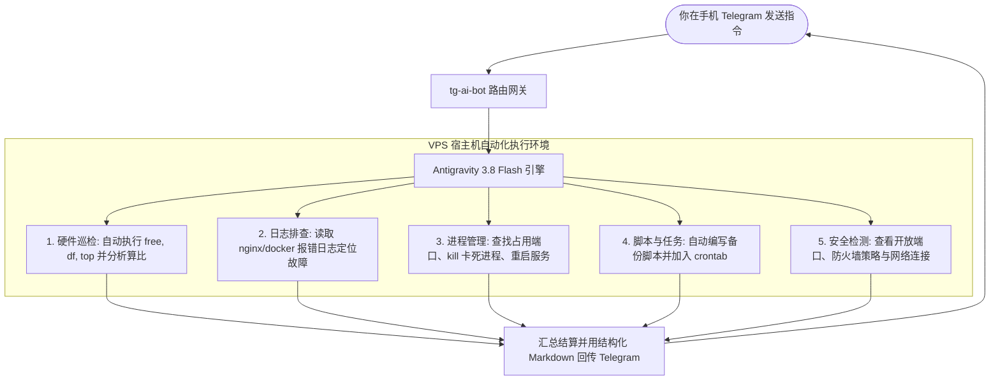

# 🤖 Telegram ↔ VPS AI DevOps Agent (Gemini 3.8 Flash)

<p align="center">
  <a href="https://github.com/Sumblink182/tg-ai-bot/stargazers"></a>
  <a href="https://github.com/Sumblink182/tg-ai-bot/network/members"></a>
  <a href="https://github.com/Sumblink182/tg-ai-bot/issues"></a>
  <a href="https://core.telegram.org/bots/api"></a>
  <a href="https://deepmind.google/technologies/gemini/"></a>
  <a href="https://www.python.org/"></a>
  <a href="./LICENSE"></a>
</p>

<p align="center">
  <b>一个将 Google Antigravity (Gemini 3.8 Flash) 深度接入 Telegram 的轻量开源 AI DevOps 运维智能体。</b><br>
  💡 <b>零 API 成本</b> | 🛠️ <b>全自动 VPS 运维自愈</b> | 🧠 <b>原生多轮深度思考</b> | 🛡️ <b>白名单防盗刷</b> | ⚡ <b>内存仅 ~20MB</b>
</p>

---

## ⚡ 极速一键安装 (One-click Install)

在你的 Linux VPS（Ubuntu / Debian）上直接执行以下命令，跟随交互提示即可一键全自动配置上线：

```bash
bash <(curl -fsSL https://raw.githubusercontent.com/Sumblink182/tg-ai-bot/main/install.sh)
```

---

## 🌟 核心理念：从“聊天玩具”到“全自动系统级 Agent”

市面上绝大多数 Telegram AI 机器人只能“纸上谈兵”给出代码让你手动执行；而本项目直接将 **拥有真实 Linux 宿主机操作权** 的 **Google Antigravity Agent** 带入 Telegram！

你在手机上随手发一句自然语言，它会在后台**自主规划、敲命令、查日志、自愈修复并向你结构化汇报**，出门在外再也无需掏出电脑连接 SSH！



---

## 🎭 双模式无缝切换 (`/mode`)

为了兼顾“日常纯问答不误触”与“全功能运维干活”，支持在 Telegram 中随时自由切换：

| 模式 | 指令 | 说明 | 权限 |
| :--- | :--- | :--- | :--- |
| **纯对话安全模式** | `/mode chat` | 适合查资料、写代码、翻译、生活咨询，仅推理问答 | 🔒 严格隔离，不执行任何系统命令 |
| **DevOps Agent 模式** | `/mode agent` | 适合远程运维、服务器体检、日志排障、写定时任务 | 🛠️ 激活宿主机 Shell、文件与进程操作权 |

---

## 🛠️ 典型实战场景展示

### 场景 1：服务器硬件与健康状态巡检
- **你在 TG 说**：`帮我看看当前 VPS 磁盘空间和内存使用`
- **Agent 自主输出**：
  > 📊 **系统资源运行报告**：  
  > • **内存**：总量 961MB，已用 589MB，可用 372MB (38.7%)，运行健康。  
  > • **磁盘**：系统盘 `/` 共 20GB，已用 4.8GB (24%)，剩余 15.2GB。  
  > • **CPU 负载**：近 1 分钟负载 0.08，系统非常空闲。

### 场景 2：网站故障排查与自愈
- **你在 TG 说**：`我的网站报 502 错误，帮我看看怎么回事并修复`
- **Agent 自主行动**：自动执行 `curl` 探测 -> 读取 `/var/log/nginx/error.log` -> 发现后端某服务端口挂掉 -> 自动执行 `systemctl restart <service>` 恢复服务 -> 回复确认。

### 场景 3：自动化脚本与定时任务
- **你在 TG 说**：`帮我写一个每天凌晨 3 点自动清理 /tmp 临时文件的脚本并加入 crontab`
- **Agent 自主行动**：创建清理脚本 -> 赋予执行权限 -> 写入 crontab 定时器 -> 回传任务配置确认。

---

## 📊 为什么选择本项目？（特性对比）

| 对比维度 | 传统 Telegram AI Bot | 本项目 (tg-ai-bot) |
| :--- | :--- | :--- |
| **API 成本** | 需持续购买 OpenAI / DeepSeek Token，高昂账单 | 💡 **完全免费**，复用本地已认证的 Antigravity 原生授权 |
| **大模型能力** | 多为 gpt-3.5 或低阶模型，缺乏思考能力 | ⚡ **Google 最新 Gemini 3.8 Flash (High)** 深度推理模型 |
| **真实系统执行** | ❌ 无法操作服务器，只能给出文字代码 | 🛠️ **全自主 Agent**，可自主运行命令排查自愈 |
| **VPS 资源占用** | 往往需要重型 Docker 容器，动辄 300MB+ | 🍃 **极轻量**，单进程常驻仅需 **~20MB** 内存 |
| **安全性** | 容易被群聊或他人盗刷 API 额度 | 🛡️ **严格白名单控制**，非授权 User ID 秒级拒绝 |
| **系统可靠性** | 临时挂起容易掉线 | 🔄 预制 **systemd 生产级守护**，开机自启、崩溃秒级自愈 |

---

## 🤖 常用 Telegram 指令速查

| 指令 | 说明 |
| :--- | :--- |
| `/start` | 启动机器人并显示欢迎指引与当前运行模式 |
| `/mode` | 查看当前模式；可使用 `/mode chat` 或 `/mode agent` 进行切换 |
| `/clear` 或 `/reset` | 清空当前会话的上下文记忆，开启新话题 |
| `/status` | 查看当前连接状态、后端模型与活跃会话 ID |
| `/id` | 获取当前用户的 Telegram 数字 ID（用于白名单配置） |
| `/help` | 查看详细帮助与命令指南 |

---

## 🚀 手动部署指南

### 1. 环境准备
- Linux 服务器（Ubuntu 22.04 / 24.04、Debian 12+）
- Python 3.10+
- 已在系统中完成认证的 [Google Antigravity CLI](https://antigravity.google) (`agy`)

```bash
git clone https://github.com/Sumblink182/tg-ai-bot.git
cd tg-ai-bot
```

### 2. 初始化环境与安装依赖
```bash
python3 -m venv venv
./venv/bin/pip install -r requirements.txt
```

### 3. 配置环境变量
```bash
cp .env.example .env
nano .env
```
配置项：
```env
# 必填：从 @BotFather 获取的 Bot Token
TELEGRAM_BOT_TOKEN=1234567890:ABCdefGhIJKlmNoPQRsTUVwxyZ

# 必填推荐：只允许你自己的 Telegram 数字 ID (防他人越权)
ALLOWED_USER_IDS=8808188711

# 选填：默认使用的模型
MODEL_NAME=gemini-3.8-flash-high

# 选填：全局默认运行模式 (chat 或 agent)
AGENT_MODE=chat
```

### 4. 注册菜单并启动常驻
```bash
# 向 Telegram 官方注册底部 Menu 快捷按钮
./venv/bin/python3 setup_menu.py

# 配置为 systemd 开机自启服务
cp tg-ai-bot.service /etc/systemd/system/
systemctl daemon-reload
systemctl enable --now tg-ai-bot

# 监控实时状态
systemctl status tg-ai-bot
journalctl -u tg-ai-bot -f
```

---

## 🔒 安全说明
本项目遵循严格的安全设计：
- 生产环境务必配置 `ALLOWED_USER_IDS`，确保只有你个人的 Telegram 账号能指挥 VPS。
- 真实的 `.env` 配置文件与运行时 `sessions.json` 已被 `.gitignore` 全面排除，绝不上传到公开代码仓库。

---

## ⭐ Star History

<p align="center">
  <a href="https://star-history.com/#Sumblink182/tg-ai-bot&Date">
    
  </a>
</p>

---

## 📄 开源许可证
本项目基于 [MIT License](./LICENSE) 开源发布。
