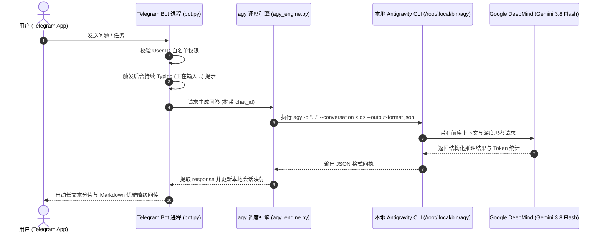

# 🤖 Telegram ↔ Antigravity (Gemini 3.8 Flash) AI Assistant

<p align="center">
  <a href="https://github.com/Sumblink182/tg-ai-bot/stargazers"></a>
  <a href="https://github.com/Sumblink182/tg-ai-bot/network/members"></a>
  <a href="https://github.com/Sumblink182/tg-ai-bot/issues"></a>
  <a href="https://core.telegram.org/bots/api"></a>
  <a href="https://deepmind.google/technologies/gemini/"></a>
  <a href="https://www.python.org/"></a>
  <a href="./LICENSE"></a>
</p>

<p align="center">
  <b>将本地 Google Antigravity CLI (Gemini 3.8 Flash) 深度桥接到 Telegram 的轻量开源 AI 机器人。</b><br>
  💡 <b>零外部 API 成本</b> | 🧠 <b>原生多轮深度思考与记忆</b> | 🛡️ <b>白名单防盗刷</b> | ⚡ <b>内存占用仅 ~20MB</b>
</p>

---

## ⚡ 极速一键安装 (One-click Install)

在你的 Linux VPS（Ubuntu / Debian）上直接执行以下命令，跟随交互提示即可一键全自动配置上线：

```bash
bash <(curl -fsSL https://raw.githubusercontent.com/Sumblink182/tg-ai-bot/main/install.sh)
```

---

## 📊 为什么选择本项目？（特性对比）

| 对比维度 | 传统 Telegram AI Bot | 本项目 (tg-ai-bot) |
| :--- | :--- | :--- |
| **API 成本** | 需持续购买 OpenAI / DeepSeek Token，长期花费高 | 💡 **完全免费**，复用本地已认证的 Antigravity 原生授权 |
| **大模型能力** | 多为 gpt-3.5 或低阶模型，推理慢 | ⚡ **Google 最新 Gemini 3.8 Flash (High)** 深度推理模型 |
| **VPS 资源占用** | 往往需要 Docker / 重型框架，动辄 200MB~500MB | 🍃 **极轻量**，单进程常驻仅需 **~20MB** 内存 |
| **安全性** | 容易被群聊或他人盗刷 API 额度 | 🛡️ **严格白名单控制**，非授权 User ID 秒级拒绝 |
| **系统可靠性** | 临时挂起容易掉线 | 🔄 预制 **systemd 生产级守护**，开机自启、崩溃秒级自愈 |
| **扩展能力** | 仅限于纯文本问答 | 🛠️ 支持切换 `agent` 模式，实现远程自动化运维与编程任务 |

---

## 🏗️ 架构原理解析



---

## 📂 项目结构

```text
├── install.sh          # 一键极速部署与向导脚本
├── setup_menu.py       # Telegram 官方快捷菜单注册脚本
├── agy_engine.py       # Antigravity CLI 子进程调度引擎与 Session 映射管理
├── bot.py              # Telegram 机器人主程序 (长轮询 + 容错切片)
├── config.py           # 环境变量与安全配置加载器
├── requirements.txt    # Python 最小化依赖清单
├── start.sh            # 快捷后台启动脚本
├── stop.sh             # 快捷后台停止脚本
├── status.sh           # 运行状态与最近日志检查脚本
├── tg-ai-bot.service   # systemd 系统守护单元配置
├── .env.example        # 环境变量配置模板
└── README.md           # 项目完整说明文档
```

---

## 🚀 手动部署教程

### 1. 环境依赖准备
- Linux 操作系统（Ubuntu 22.04 / 24.04、Debian 12+）
- Python 3.10+
- 已在系统中完成认证的 [Google Antigravity CLI](https://antigravity.google) (`agy`)

```bash
git clone https://github.com/Sumblink182/tg-ai-bot.git
cd tg-ai-bot
```

### 2. 初始化虚拟环境
```bash
python3 -m venv venv
./venv/bin/pip install -r requirements.txt
```

### 3. 配置 `.env` 文件
```bash
cp .env.example .env
nano .env
```
修改核心配置：
```env
# 必填：从 @BotFather 获取的 Bot Token
TELEGRAM_BOT_TOKEN=1234567890:ABCdefGhIJKlmNoPQRsTUVwxyZ

# 选填：只允许你自己使用的 Telegram 数字 ID (防盗刷)
ALLOWED_USER_IDS=8808188711

# 选填：默认使用的模型
MODEL_NAME=gemini-3.8-flash-high

# 选填：运行模式 (chat: 安全问答; agent: 远程执行)
AGENT_MODE=chat
```

### 4. 注册官方菜单并启动
```bash
# 注册 Telegram 底部 Menu 按钮
./venv/bin/python3 setup_menu.py

# 注册为 systemd 开机自启服务
cp tg-ai-bot.service /etc/systemd/system/
systemctl daemon-reload
systemctl enable --now tg-ai-bot

# 监控实时状态
systemctl status tg-ai-bot
journalctl -u tg-ai-bot -f
```

---

## 🤖 常用 Telegram 指令

| 指令 | 说明 |
| :--- | :--- |
| `/start` | 启动机器人并显示功能概览与快捷入口 |
| `/clear` 或 `/reset` | 清空当前对话上下文记忆，开启新话题 |
| `/status` | 查看当前连接状态、后端模型与会话 ID |
| `/id` | 获取当前用户的 Telegram 数字 ID（方便填入白名单） |
| `/help` | 查看详细帮助与说明指南 |

---

## 🔒 隐私与安全性保障
- 本项目遵循严格的安全工程规范，真实 `.env` 与会话缓存 `sessions.json` 已被 `.gitignore` 彻底隔离，绝不会上传。
- 强烈建议在生产环境配置 `ALLOWED_USER_IDS`，开启白名单防护。

---

## ⭐ Star History

<p align="center">
  <a href="https://star-history.com/#Sumblink182/tg-ai-bot&Date">
    
  </a>
</p>

---

## 📄 开源许可证
本项目基于 [MIT License](./LICENSE) 开源发布。
